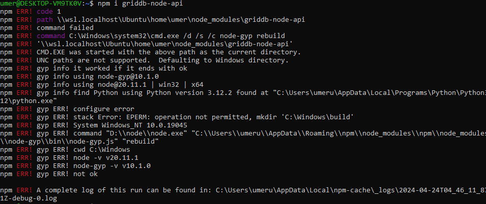
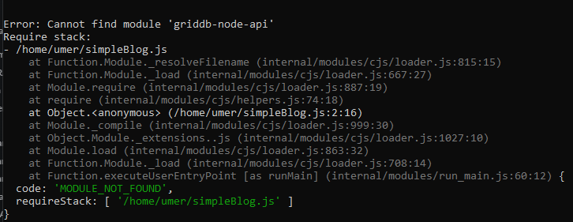
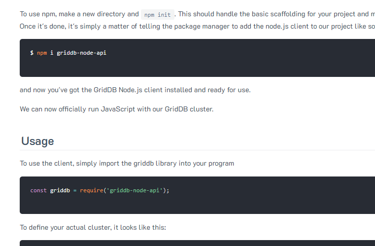
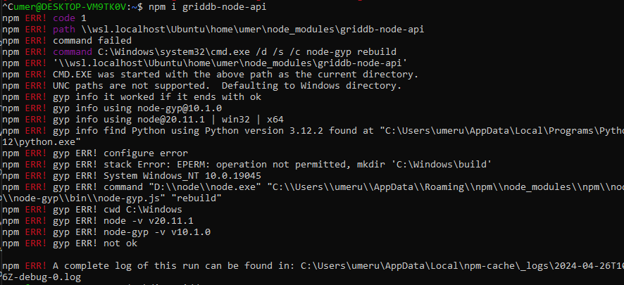
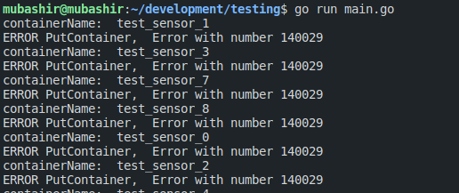
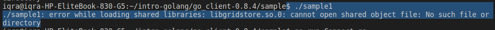

# Issues with GridDB

## Q-No.1

I'm encountering an error while trying to install the griddb-node-api package on Ubuntu with GridDB v5.5 and Node.js v20.11. 

I'm using the command 
```
npm i griddb-node-api, 
```
but I'm getting the following error:




I'm running Ubuntu as my operating system, GridDB version 5.5, and Node.js version 20.11. My intention is to utilize GridDB with Node.js, and for that, I need to install the griddb-node-api package.

Im following this Documentation: 
https://docs.griddb.net/latest/gettingstarted/nodejs/#installation



Here's the error message I'm encountering:



Could someone help me understand why this error is occurring and how to resolve it? Thank you!

## Q-No.2

I'm setting up GridDB using Docker and integrating it with a Go client using the official repository and documentation. However, I'm encountering an issue with the `PutContainer` method. Here's a simplified version of my code:

code: 
```
for containerName := range fullDataset {
		fmt.Println("containerName: ", containerName)
		conInfo, err := griddb_go.CreateContainerInfo(map[string]interface{}{
			"name": containerName,
			"column_info_list": [][]interface{}{
				{"timestamp", griddb_go.TYPE_TIMESTAMP},
				{"id", griddb_go.TYPE_SHORT},
				{"data", griddb_go.TYPE_FLOAT},
				{"temperature", griddb_go.TYPE_FLOAT}},
			"type":    griddb_go.CONTAINER_TIME_SERIES,
			"row_key": true})
		if err != nil {
			fmt.Println("ERROR CreateContainerInfo")
		}
		defer griddb_go.DeleteContainerInfo(conInfo)

		_, err = gridstore.PutContainer(conInfo)
		if err != nil {
			fmt.Println("ERROR PutContainer, ", err)
		}
	}
```

When I run this code, I get the following error:

```
containerName:  test_sensor_1
ERROR PutContainer,  Error with number 140029
```



I'm not sure what this error means or how to resolve it. Any help would be appreciated. Thank you!

## Q-No.3

I'm encountering an error when trying to run a sample file after installing GridDB on Ubuntu with the Go client. Here are the details of my setup:

GridDB version: 5.5.1
Go version: go1.18.1
Operating system: Ubuntu Linux (amd64)
I followed the installation instructions provided in the GridDB documentation for Ubuntu (link) and for installing the Go client (link).

However, when I attempt to run a sample file, I encounter an error. Here's the error message:

```
./sample.go
```

It gives me the error:

```
libgridstore.so.0: cannot open shared object file: No such file or directory
```



I've followed all the steps outlined in the documentation, but I'm still encountering this issue. Could someone help me understand why this error is occurring and how to resolve it? Thank you!

