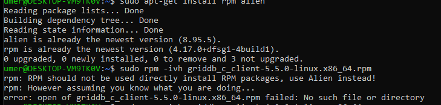
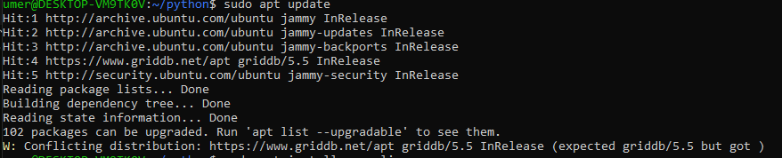
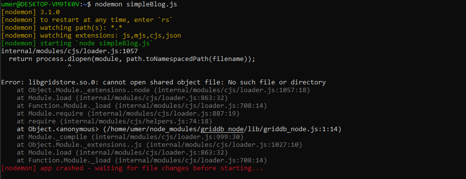

# Issues with GridDB

## Q-No.1

I'm encountering an error while trying to install the griddb-node-api package on Ubuntu with GridDB v5.5 and Node.js v20.11. I'm using the command npm i griddb-node-api, but I'm getting the following error:


I'm running Ubuntu as my operating system, GridDB version 5.5, and Node.js version 20.11. My intention is to utilize GridDB with Node.js, and for that, I need to install the griddb-node-api package.

Im following this Documentation: 
https://docs.griddb.net/latest/gettingstarted/nodejs/#installation


Here's the error message I'm encountering:


Could someone help me understand why this error is occurring and how to resolve it? Thank you!


## Q-No.2

I have already installed Alien and RPM to run the RPM package for GridDB, but still, it shows the same error.

```
RPM should not be used directly. Install RPM packages using Alien instead! 
```


## Q-No.3

Whenever I try to do some operation by following the GridDB documentation and I give the command:

```
sudo apt update
```

it give me the warning

```
W: Conflicting distribution: https://www.griddb.net/apt griddb/5.5 InRelease (expected griddb/5.5 but got )
```



## Q-No.4

Whenever I create any app by following the complete GridDB documentation and create a (Sample) file same as they create but when I try to run:

Like

```
node sampleBlog.js
```

It gives me the error:

```
libgridstore.so.0: cannot open shared object file: No such file or directory
```


